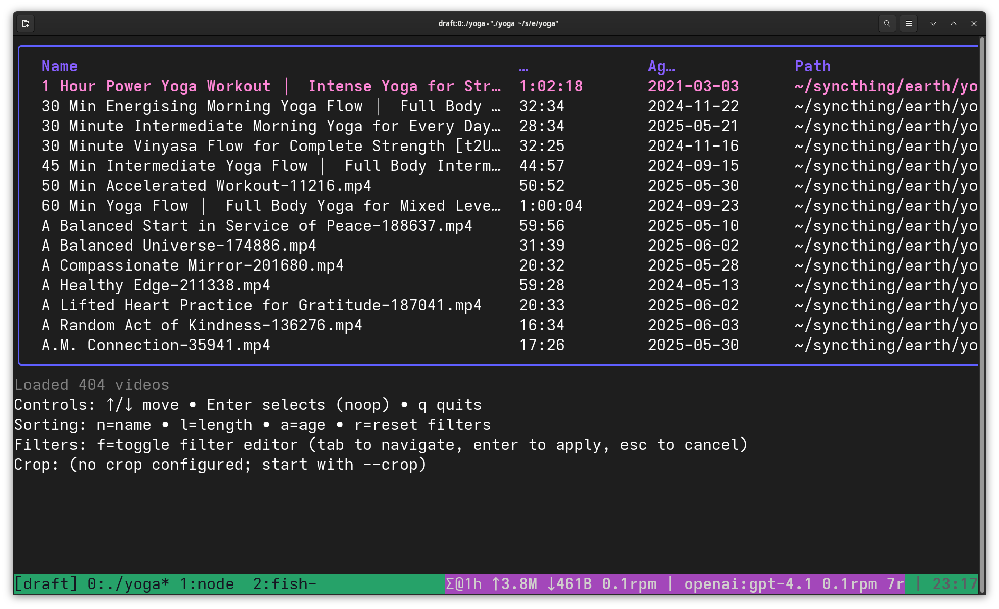

# Yoga

Yoga is a GUI and TUI for browsing local yoga videos with quick filtering, duration probing, and one-key playback via VLC. It has been vibe coded.



## Usage

### GUI Mode (default)

```bash
yoga [--root PATH] [--crop WxH] [--version]
```

- `--root` sets the directory to scan for videos. When omitted, Yoga uses `~/Yoga` and creates it on first launch.
- `--crop` supplies an optional VLC crop string (for example `5:4`).
- `--version` prints the current version and exits.

Yoga recognises common video extensions (`.mp4`, `.mkv`, `.mov`, `.avi`, `.wmv`, `.m4v`) and follows symlinks when scanning. Duration metadata is cached per directory in `.video_duration_cache.json`. Thumbnail images are cached in `.thumbnails/` subdirectories.

### TUI Mode (legacy)

To use the terminal interface instead of the GUI:

```bash
yoga --gui=false [--root PATH] [--crop WxH] [--version]
```

## GUI Keyboard Shortcuts

- `↑/↓` – Navigate the video list
- `enter` – Play the selected video in VLC
- `f` or `/` – Open the filter dialog
- `n` – Sort by name
- `l` – Sort by duration
- `a` – Sort by age
- `c` – Toggle VLC crop
- `t` – Edit tags for the selected video
- `r` – Select a random video from filtered results
- `delete` – Reset filters
- `h` – Refresh video list
- `i` – Re-index videos
- `escape` or `q` – Quit

## TUI Keyboard Shortcuts (legacy mode)

- `↑/↓` – Navigate the table
- `enter` – Play the selected video in VLC
- `/` or `f` – Open the filter dialog
- `tab` / `shift+tab` – Move between fields in filter/tag dialogs
- `r` – Reset filters
- `n`, `l`, `a` – Sort by name, length, or age
- `c` – Toggle VLC crop
- `t` – Edit tags for the selected video
- `x` – Select a random video from filtered results
- `H` / `h` – Hide or re-show the help footer
- `q` – Quit

## Filter Dialog

- Focus starts on the name filter when you press `f` or `/`.
- Use `tab` and `shift+tab` to move to **Min minutes**, **Max minutes**, or **Tags contain**.
- Type numeric values for the minute bounds; leave them blank to disable that side of the range.
- Press `enter` to apply the filters or `esc` to cancel.
- Status text reflects how many videos remain after filtering.

## Development

The project uses [Mage](https://magefile.org/) for common tasks. Targets live in `magefile.go`.

```bash
mage build     # go build ./cmd/yoga
mage test      # go test ./...
mage install   # go install ./cmd/yoga
mage coverage  # go test with coverage (fails if <85%)
```

Before sending changes:

1. Format Go code with `gofumpt`.
2. Run `mage test` and `mage coverage` to ensure the suite passes and coverage stays above 85%.
3. Update documentation when flags or behaviour change.

## Licensing

This repository is released under the terms specified in the accompanying license file (if present).
